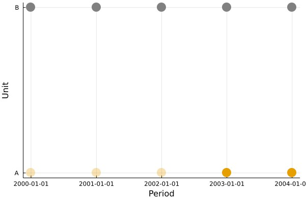
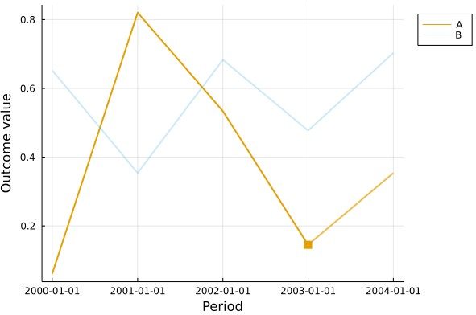

[](https://github.com/nilshg/TreatmentPanels.jl/actions/workflows/ci.yml)

# TreatmentPanels

Julia package that defines structs to hold panel data for use in causal inference estimation. This
package is used in the package [`SynthControl`](https://github.com/nilshg/SynthControl) to provide
input data types for different synthetic control algorithms. 

## Installation

The package is registered in the General Registry and can be added via

```
julia> Pkg.add("TreatmentPanels")
```

or in the Pkg REPL

```
(@v1.7) add TreatmentPanels
```

## Quickstart

The basic idea of the package is to combine a `DataFrame` with a specification of treatment
assignment to construct a an outcome matrix `Y`, and an accompanying treatment matrix `W`. Both `Y`
and `W` follow the convention that a row is an observational unit and a column is a time period -
i.e. it can be seen as a "wide" panel data set. 

```
julia> using DataFrames, TreatmentPanels

julia> data = DataFrame(region = repeat(["A", "B"], inner = 5), year = repeat(Date(2000):Year(1):Date(2004), 2), outcome = rand(10))
10×3 DataFrame
 Row │ region  year        outcome   
     │ String  Date        Float64   
─────┼───────────────────────────────
   1 │ A       2000-01-01  0.0605538
   2 │ A       2001-01-01  0.820218
   3 │ A       2002-01-01  0.533732
   4 │ A       2003-01-01  0.144979
   5 │ A       2004-01-01  0.353885
   6 │ B       2000-01-01  0.65294
   7 │ B       2001-01-01  0.353973
   8 │ B       2002-01-01  0.683144
   9 │ B       2003-01-01  0.477427
  10 │ B       2004-01-01  0.702888

julia> bp = BalancedPanel(data, "A" => Date(2003); id_var = "region", t_var = "year", outcome_var = "outcome")
Balanced Panel - single unit, single continuous treatment
    Treated unit: A
    Number of untreated units: 1
    First treatment period: 2003-01-01
    Number of pretreatment periods: 3
    Number of treatment periods: 2

julia> bp.Y
2×5 Matrix{Float64}:
 0.0605538  0.820218  0.533732  0.144979  0.353885
 0.65294    0.353973  0.683144  0.477427  0.702888

julia> bp.W
2×5 Matrix{Bool}:
 0  0  0  1  1
 0  0  0  0  0
```

The package provides simple plotting functionality to visualise treatment assignment and outcomes:

```
julia> using Plots

julia> plot(bp, markersize = 10)
```


```
julia> plot(bp; kind = "outcome")
```


## Types provided

There are two basic types:

* `BalancedPanel{T1, T2} <: TreatmentPanel` holds panel data in which each
  unit of observation $i = 1, ..., N$ is observed for $t = 1, ..., T$ periods
* `UnbalancedPanel{T1, T2}` holds panel data in which there might be a
  different number of periods for each unit of observation

Basic usage of the `BalancedPanel` constructor is

```
BalancedPanel(data::DataFrame, treatment_assignment; id_var, t_var, outcome_var)::BalancedPanel{T1, T2}
```

where 

* `data` is a DataFrame holding the panel data, including columns holding `id_var`, `t_var`, and
  `outcome_var`
* `treatment_assignment` specifies the units treated and timing of treatment. 
* `id_var` is the name of the column in `data` holding the unit identifier
* `t_var` is the name of the column in `data` holding the time identifier
* `outcome_var` is the name of the column in `data` holding data on the  outcome variable of interest

`T1 <: UnitTreatmentType` and `T2 <: TreatmentDurationType` are types indicating the nature the
treatment observed. `UnitTreatmentType` currently has three concrete types:

* `SingleUnitTreatment` - only one unit of observation is subject to treatment
* `MultiUnitSimultaneousTreatment` - multiple units are being treated in the same time period
* `MultiUnitStaggeredTreatment` - multiple units are being treated in different periods

`TreatmentDurationType` currently has two concrete types:

* `ContinuousTreatment` - once a unit is treated, it remains treated for the remainder of the
  observation period
* `StartEndTreatment` - the treatment has an end point in time, i.e. treated units revert to being
  untreated at some point

The types of `T1` and `T2` are automatically chosen based on the `treatment_assignment` passed. 

|                     |  Only starting point        |   Start and end point                     |   Multiple start & end points                     |
|---------------------|-----------------------------|-------------------------------------------|---------------------------------------------------|
| **one unit**        |  Pair{String, Date}         |   Pair{String, Tuple{Date, Date}}         |  Pair{String}, Vector{Tuple{Date, Date}}}         |
| **multiple units**  |  Vector{Pair{String, Date}} |   Vector{Pair{String, Tuple{Date, Date}}} |  Vector{Pair{String, Vector{Tuple{Date, Date}}}}  |

As an example, calling `BalancedPanel(data, "unit1" => Date(2000))` will return an object of type
`BalancedPanel{SingleUnitTreatment, ContinuousTreatment}`, as only one unit is treated and only a
start point for treatment is provided, so it is assumed that all periods from the year 2000 onwards
are treatment periods. `BalancedPanel(data, "unit1" => (Date(2000) => Date(2010))` in contrast will
return a `BalancedPanel{SingleUnitTreatment, StartEndTreatment}`, and any observations in the year
2011 or after will be considered untreated. 

While many of the convenience methods in this package are specialised on the concrete types of `T1`
and `T2`, their main role is in supporting dispatch for synthetic control models. As an example, a
standard synthetic control model is designed to estimate the impact of a continuous treatment for a
single unit, and hence should accept a `BalancedPanel{SingleUnitTreatment, ContinuousTreatment}` as
input, while a staggered synthetic control model will accept a
`BalancedPanel{MultiUnitStaggeredTreatment, T2}`. In this way, the type of the `BalancedPanel`
passed to an estimation routine can be used to enforce the data structure assumed in the routine. 
